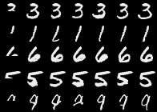
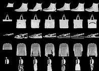
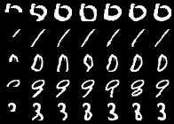

# Image GPT

PyTorch implementation of Image GPT, based on paper *Generative Pretraining from Pixels* [(Chen et al.)](https://cdn.openai.com/papers/Generative_Pretraining_from_Pixels_V2.pdf)
and accompanying [code](https://github.com/openai/image-gpt).

 
<br>
*Model-generated completions of half-images from test set. First column is
input; last column is original image*


<br>
*iGPT-S pretrained on `cifar10`. Completions are fairly poor as the model was
only trained on `cifar10`, not all of ImageNet.*

*Model-generated completions of half-images from test set. First column is
input; last column is original image*
**TODO:**
 * Batched *k*-means on GPU for quantization of larger datasets (currently using
     `sklearn.cluster.MiniBatchKMeans`.)
 * BERT-style pretraining (currently only generative is supported.)
 * Load pretrained models from OpenAI.
 * Reproduce at least iGPT-S results.

According to their [blog post](https://openai.com/blog/image-gpt/), the largest
model, iGPT-L (1.4 M parameters), was trained for 2500 V100-days. By greatly reducing the number of
attention head, number of layers, and input size (which effects model size
quadratically), we can train our own model (26 K parameters) on
[Fashion-MNIST](https://github.com/zalandoresearch/fashion-mnist) on a single
NVIDIA 2070 in less than 2 hours.

- [Image GPT](#image-gpt)
  * [Usage](#usage)
    + [Pre-trained Models](#pre-trained-models)
    + [Compute Centroids](#compute-centroids)
    + [Training](#training)
      - [Generative Pre-training](#generative-pre-training)
      - [Classification Fine-tuning](#classification-fine-tuning)
    + [Sampling](#sampling)

## Usage

### Pre-trained Models

Some pre-trained models are located in `models` directory. Run `./download.sh`
to download the `cifar10` pretrained iGPT-S model.

### Compute Centroids

Images are downloaded, and centroids are computed using *k*-means with
`num_clusters` clusters.  These centroids are used to quantize the images before
they are fed into the model.

```bash
# options: mnist, fmnist, cifar10
python src/compute_centroids.py --dataset mnist --num_clusters=8

# creates data/<dataset>_centroids.npy
```

*Note: Use the same `num_clusters` as `num_vocab` in your model*.

### Training

Models can be trained using `src/run.py` with the `train` subcommand. 

#### Generative Pre-training

Models can be pretrained by specifying a dataset and model config.
`configs/s_gen.yml` corresponds to iGPT-S from the paper, `configs/xxs_gen.yml`
is an extra small model for trying on toy datasets with limited compute.

```bash
python src/run.py --dataset mnist train configs/xxs_gen.yml
```

#### Classification Fine-tuning

Pre-trained models can be fine-tuned by passing the path to the pre-trained
checkpoint to `--pretrained`, along with the config file and dataset.

```bash
python src/run.py --dataset mnist train configs/xxs_clf.yml --pretrained=models/mnist_gen.ckpt`
```

### Sampling 

Figures like those seen above can be created using random images from
test set:

```bash
# outputs to figure.png
python src/sample.py models/mnist_gen.ckpt
```

Gifs like the one seen in [my tweet](https://twitter.com/teddykoker/status/1275809619705806850) can be made
like so:

```bash
# outputs to out.gif
python src/gif.py models/mnist_gen.ckpt
```
